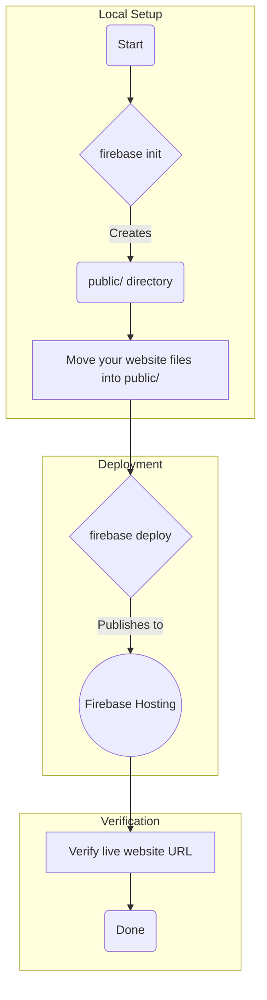

# Firebase Deployment Plan

This document outlines the steps to deploy the website to Firebase Hosting.

## Overview

The main goal is to get the content of your `index.html` file into the `public` directory that Firebase created and then deploy it.

## Detailed Steps

1.  **Move Website to `public` Directory:** The `firebase init` command created a `public` directory with a default `index.html`. We need to replace that default file with your actual website. We'll move your existing `index.html` into the `public` folder.

2.  **Deploy to Firebase:** Once your file is in the right place, we'll run the `firebase deploy` command. This will upload everything in the `public` folder to Firebase's servers.

3.  **Verify:** After the deployment is complete, you'll get a unique URL (like `glowtejam-aead5.web.app`). We can open this in a browser to see your live website.

## Deployment Results

✅ **Deployment Complete!**

- **Live Website URL:** https://glowtejam-aead5.web.app
- **Firebase Console:** https://console.firebase.google.com/project/glowtejam-aead5/overview
- **Status:** Successfully deployed
- **Files Uploaded:** 1 file (index.html)

Your GLOWTEJAM fashion website is now live and accessible to anyone on the internet!